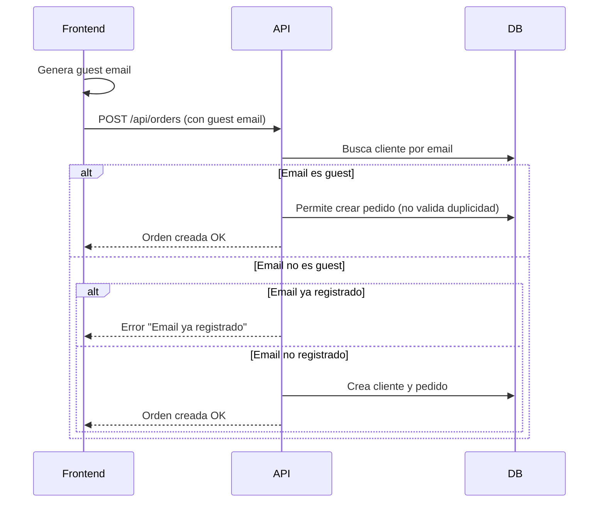

# 🛒 Guest Checkout y Emails de Invitado

Esta guía explica cómo funciona el flujo de checkout para usuarios invitados en el backend, cómo deben formatearse los emails de invitado, los endpoints relevantes, ejemplos de request/response y consideraciones importantes para el frontend.

---

## 1. ¿Qué es un "Guest Email"?

Un **guest email** es un email generado automáticamente por el frontend para usuarios que compran sin registrarse. El backend reconoce estos emails y permite crear pedidos sin bloquear por duplicidad, incluso si el mismo email se usa varias veces.

**Patrones válidos de guest email:**
- `guest_<timestamp>_<random>_<random>_<random>@checkout.guest`
- Cualquier email que termine en `@checkout.guest`
- Cualquier email que comience con `guest_`

Ejemplo real:
```text
guest_1752580352601_56436599_922668294_umy4h586z7_qwe@checkout.guest
```

---

## 2. Endpoint de Checkout para Invitados

### `POST /api/orders`

**Headers:**
```
Content-Type: application/json
```
(No requiere JWT para invitados)

**Body para invitado:**
```json
{
  "customerData": {
    "name": "Invitado",
    "email": "guest_1752580352601_56436599_922668294_umy4h586z7_qwe@checkout.guest",
    "phone": "+123456789",
    "address": "Calle 123",
    "neighborhoodId": "<mongoId>"
  },
  "shippingAddress": {
    "street": "Calle 123",
    "cityId": "<mongoId>",
    "neighborhoodId": "<mongoId>"
  },
  "items": [
    { "productId": "<mongoId>", "quantity": 1, "unitPrice": 100 }
  ],
  "notes": "opcional"
}
```

**Respuesta exitosa (201):**
```json
{
  "success": true,
  "message": "Orden creada exitosamente",
  "data": {
    "id": "orderId",
    "customer": { ... },
    "items": [ ... ],
    "status": "PENDING",
    "total": 200
  }
}
```

---

## 3. ¿Cómo reconoce el backend un email de invitado?

El backend utiliza la utilidad `GuestEmailUtil` para detectar emails de invitado. Si el email cumple alguno de los patrones, **no se bloquea la creación del pedido aunque ya exista un cliente con ese email**.

**Lógica simplificada:**
```typescript
if (existingCustomer && !GuestEmailUtil.isGuestEmail(email)) {
  if (existingCustomer.userId) {
    throw CustomError.badRequest('Email ya registrado. Inicia sesión.');
  }
}
// Si es guest email, permite crear el pedido
```

---

## 4. Diagrama de Flujo Guest Checkout



---

## 5. Consideraciones para el Frontend

- **Siempre generar guest emails únicos** para cada checkout de invitado.
- El backend nunca bloqueará por duplicidad de email si el email es guest.
- El mismo guest email puede ser usado varias veces para distintos pedidos.
- Si el usuario se registra, debe usar un email real (no guest).
- El endpoint `/api/orders` acepta tanto usuarios registrados (con JWT) como invitados (sin JWT).
- Si se envía un email real ya registrado, el backend responderá con error.

---

## 6. Ejemplo de Request/Response

### Request (Invitado):
```http
POST /api/orders
Content-Type: application/json

{
  "customerData": {
    "name": "Invitado",
    "email": "guest_1752580352601_56436599_922668294_umy4h586z7_qwe@checkout.guest",
    "phone": "+123456789",
    "address": "Calle 123",
    "neighborhoodId": "65f1b2c3d4e5f6a7b8c9d0e1"
  },
  "shippingAddress": {
    "street": "Calle 123",
    "cityId": "65f1b2c3d4e5f6a7b8c9d0e2",
    "neighborhoodId": "65f1b2c3d4e5f6a7b8c9d0e1"
  },
  "items": [
    { "productId": "65f1b2c3d4e5f6a7b8c9d0e3", "quantity": 1, "unitPrice": 100 }
  ]
}
```

### Response (201):
```json
{
  "success": true,
  "message": "Orden creada exitosamente",
  "data": {
    "id": "65f1b2c3d4e5f6a7b8c9d0e4",
    "customer": {
      "name": "Invitado",
      "email": "guest_1752580352601_56436599_922668294_umy4h586z7_qwe@checkout.guest",
      ...
    },
    "items": [ ... ],
    "status": "PENDING",
    "total": 100
  }
}
```

---

## 7. Preguntas Frecuentes (FAQ)

- **¿Puedo usar el mismo guest email varias veces?**
  - Sí, el backend lo permite.
- **¿Qué pasa si uso un email real de un usuario registrado?**
  - El backend rechaza el pedido con error.
- **¿Puedo hacer login con un guest email?**
  - No, solo sirve para pedidos de invitado.
- **¿El guest checkout requiere JWT?**
  - No, solo para usuarios registrados.

---

> Para dudas técnicas, consultar con backend o revisar los tests de integración en `/tests/integration/order/guest-email-flow.integration.test.ts`.
