# Diagramas de Flujo - Sistema MCP Inteligente

## Diagrama de Secuencia Detallado

```mermaid
sequenceDiagram
    participant U as Usuario
    participant API as Express Router
    participant MC as MCPController
    participant DT as detectRequiredTools
    parameter EP as extractParameters
    participant ET as executeToolAutomatically
    participant UC as CallToolUseCase
    participant MR as MCPRepository
    participant MD as MCPDataSourceImpl
    participant PR as ProductRepository
    participant PM as ProductMongoDS
    participant DB as MongoDB
    participant FM as formatResponse

    U->>API: POST /api/mcp/chat<br/>{"message": "¿Cuál es el precio de las empanadas?"}
    API->>MC: handleChatMessage(req, res)
    
    Note over MC: 1. Validación de entrada
    MC->>MC: Validate message exists
    
    Note over MC: 2. Detección inteligente
    MC->>DT: detectRequiredTools(message)
    DT->>DT: extractProductSearchTerm("empanadas")
    DT->>DT: isValidProductTerm("empanadas") → true
    DT-->>MC: ["search_products"]
    
    Note over MC: 3. Extracción de parámetros
    MC->>EP: extractParametersFromMessage(message, "search_products")
    EP->>EP: extractProductSearchTerm(message) → "empanadas"
    EP-->>MC: {q: "empanadas", page: 1, limit: 10}
    
    Note over MC: 4. Ejecución automática
    MC->>ET: executeToolAutomatically("search_products", params)
    ET->>UC: execute("search_products", params)
    UC->>MR: callTool("search_products", params)
    MR->>MD: searchProducts(params)
    
    Note over MD: 5. Procesamiento en DataSource
    MD->>MD: Create PaginationDto
    MD->>PR: searchByName("empanadas", pagination)
    PR->>PM: searchByName("empanadas", pagination)
    
    Note over PM: 6. Query a MongoDB
    PM->>DB: find({name: {$regex: "empanadas", $options: "i"}, isActive: true})
    DB-->>PM: [empanadas_arabes_document]
    PM->>PM: ProductMapper.fromObjectToEntity()
    PM-->>PR: {items: [ProductEntity], total: 1}
    PR-->>MD: {items: [ProductEntity], total: 1}
    
    Note over MD: 7. Formato de respuesta del DataSource
    MD-->>MR: {products: [ProductEntity], total: 1, page: 1, limit: 10}
    MR-->>UC: response_data
    UC-->>ET: response_data
    ET-->>MC: {success: true, data: response_data}
    
    Note over MC: 8. Formateo para usuario
    MC->>FM: formatToolResultForUser(data, "search_products")
    FM->>FM: formatProductsResponse(data)
    FM-->>MC: "🍕 **Nuestros Productos Disponibles** (1 productos en total)..."
    
    Note over MC: 9. Respuesta HTTP
    MC-->>API: JSON Response
    API-->>U: {<br/>  "success": true,<br/>  "message": "🍕 **Nuestros Productos...",<br/>  "tool_used": "search_products",<br/>  "tool_params": {...}<br/>}
```

## Diagrama de Flujo de Decisión de Herramientas

```mermaid
flowchart TD
    A[Mensaje del Usuario] --> B{¿Contiene término específico?}
    
    B -->|Productos| C[extractProductSearchTerm]
    B -->|Clientes| D[extractCustomerSearchTerm]
    B -->|Órdenes| E[extractOrderSearchParams]
    B -->|No específico| F{¿Palabras clave generales?}
    
    C --> G{¿Término válido?}
    G -->|Sí| H[search_products]
    G -->|No| I[get_products]
    
    D --> J{¿Término válido?}
    J -->|Sí| K[search_customers]
    J -->|No| L[get_customers]
    
    E --> M{¿Filtros detectados?}
    M -->|Sí| N[get_orders + filtros]
    M -->|No| O[get_orders]
    
    F -->|"productos"| I
    F -->|"clientes"| L
    F -->|"pedidos"| O
    F -->|No reconocido| P[Sin herramienta]
    
    H --> Q[Ejecutar herramienta]
    I --> Q
    K --> Q
    L --> Q
    N --> Q
    O --> Q
    P --> R[Error: No se pudo entender]
    
    Q --> S[Formatear respuesta]
    S --> T[Devolver al usuario]
```



## Diagrama de Arquitectura en Capas


## Diagrama de Patrones Regex para Detección

```mermaid
graph TD
    A[Mensaje: "¿Cuál es el precio de las empanadas?"] --> B[Aplicar Patrones Regex]
    
    B --> C[Patrón 1: /precio de (?:la|las|el|los)\s+([^?]+)/i]
    B --> D[Patrón 2: /cuanto cuesta (?:la|las|el|los)\s+([^?]+)/i]
    B --> E[Patrón 3: /costo de (?:la|las|el|los)\s+([^?]+)/i]
    B --> F[Patrón 4: /información sobre (?:la|las|el|los)\s+([^?]+)/i]
    
    C --> G{¿Match?}
    G -->|Sí| H[Capturar: "empanadas"]
    G -->|No| I[Siguiente patrón]
    
    H --> J[isValidProductTerm("empanadas")]
    J --> K{¿Es válido?}
    K -->|Sí| L[validProductTerms.includes("empanadas")]
    K -->|No| M[Rechazar término]
    
    L --> N[✅ Término extraído: "empanadas"]
    M --> O[❌ Término no válido]
    
    N --> P[Usar search_products]
    O --> Q[Usar get_products]
```

## Diagrama de Flujo de Parámetros

```mermaid
graph LR
    A[Tool: "search_products"] --> B[extractParametersFromMessage]
    A1[Tool: "get_customers"] --> B
    A2[Tool: "get_orders"] --> B
    
    B --> C{Switch por herramienta}
    
    C -->|search_products| D[extractProductSearchTerm]
    C -->|search_customers| E[extractCustomerSearchTerm]
    C -->|get_orders| F[extractOrderSearchParams]
    C -->|get_*| G[Parámetros base]
    
    D --> H[params.q = término]
    E --> I[params.q = término]
    F --> J[params.status = estado]
    F --> K[params.dateFrom = fecha]
    G --> L[params.page = 1]
    
    H --> L
    I --> L
    J --> L
    K --> L
    L --> M[params.limit = 10]
    
    M --> N[Retornar parámetros]
```

## Diagrama de Respuesta y Formateo

```mermaid
graph TD
    A[Datos de MongoDB] --> B[Mapper.fromObjectToEntity]
    B --> C[Array de Entidades]
    C --> D[formatToolResultForUser]
    
    D --> E{¿Tipo de herramienta?}
    E -->|Products| F[formatProductsResponse]
    E -->|Customers| G[formatCustomersResponse]
    E -->|Orders| H[formatOrdersResponse]
    
    F --> I[🍕 **Nuestros Productos Disponibles**]
    F --> J[💰 Precio: $X.XX]
    F --> K[📦 Stock: X unidades]
    F --> L[🏷️ Categoría: X]
    
    G --> M[👥 **Clientes Registrados**]
    G --> N[📧 Email: X]
    G --> O[📱 Teléfono: X]
    
    H --> P[📋 **Pedidos Registrados**]
    H --> Q[💰 Total: $X]
    H --> R[📅 Fecha: X]
    H --> S[📊 Estado: X]
    
    I --> T[Respuesta Final]
    J --> T
    K --> T
    L --> T
    M --> T
    N --> T
    O --> T
    P --> T
    Q --> T
    R --> T
    S --> T
    
    T --> U[💬 ¿Te interesa algún producto en particular?]
    U --> V[JSON Response]
```


