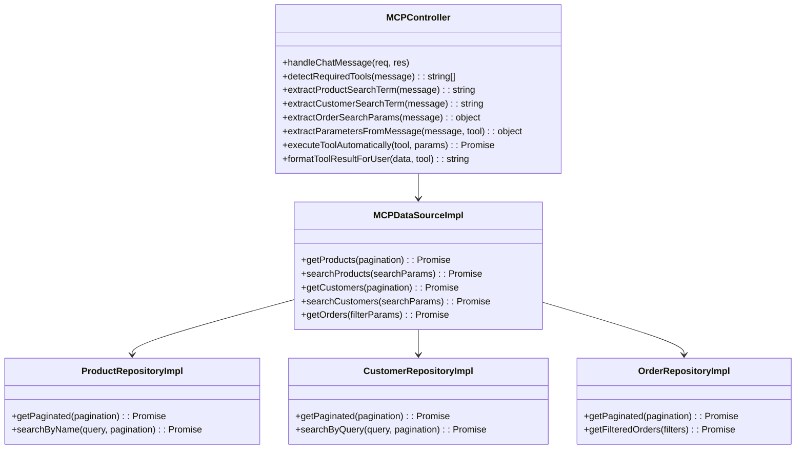

# Sistema de Detección Inteligente de Herramientas MCP

## Resumen Ejecutivo

Este documento describe el **Sistema de Detección Inteligente de Herramientas MCP (Model Context Protocol)** implementado en el backend del e-commerce. El sistema permite que los usuarios hagan consultas en lenguaje natural y automáticamente detecta, ejecuta y formatea las respuestas de las herramientas apropiadas.

### Problema Resuelto
- **Antes**: Query "¿Cuál es el precio de las empanadas?" devolvía TODOS los productos (16)
- **Después**: La misma query devuelve SOLO las empanadas (1 producto específico)

### Capacidades del Sistema
- 🧠 **Detección inteligente** de herramientas basada en análisis de texto
- 🔍 **Extracción automática** de parámetros de búsqueda
- ⚡ **Ejecución automática** de herramientas sin intervención manual
- 📝 **Formateo inteligente** de respuestas para el usuario final
- 🛡️ **Manejo robusto** de errores y casos edge

---

## Arquitectura del Sistema

### Diagrama de Flujo Principal

```mermaid
graph TD
    A[Usuario envía query: "¿Cuál es el precio de las empanadas?"] --> B[POST /api/mcp/chat]
    B --> C[MCPController.handleChatMessage]
    C --> D[detectRequiredTools - Análisis de texto]
    D --> E{¿Query específica?}
    E -->|Sí| F[extractProductSearchTerm: "empanadas"]
    E -->|No| G[Herramienta general: get_products]
    F --> H[Herramienta específica: search_products]
    H --> I[extractParametersFromMessage]
    I --> J[Parámetros: {q: "empanadas", page: 1, limit: 10}]
    J --> K[executeToolAutomatically]
    K --> L[MCPDataSourceImpl.searchProducts]
    L --> M[ProductRepositoryImpl.searchByName]
    M --> N[MongoDB Query con filtro]
    N --> O[Resultados: 1 empanada]
    O --> P[formatToolResultForUser]
    P --> Q[Respuesta formateada con emojis]
    Q --> R[JSON Response al usuario]
```

### Diagrama de Arquitectura de Clases



---

## Flujo Detallado de Ejecución

### 1. Punto de Entrada: Ruta HTTP

**Archivo**: `src/presentation/mcp/routes.mcp.ts`

```typescript
// Ruta para chat con detección inteligente de herramientas
router.post('/chat', (req: Request, res: Response) => { 
    controller.handleChatMessage(req, res) 
});
```

**Request Format**:
```json
{
    "message": "¿Cuál es el precio de las empanadas?"
}
```

### 2. Controlador Principal

**Archivo**: `src/presentation/mcp/controller.mcp.ts`

#### Método: `handleChatMessage`
```typescript
public handleChatMessage = async (req: Request, res: Response) => {
    // 1. Validar entrada
    const { message } = req.body;
    
    // 2. Detectar herramientas requeridas
    const requiredTools = this.detectRequiredTools(message);
    
    // 3. Extraer parámetros
    const toolParams = this.extractParametersFromMessage(message, tool);
    
    // 4. Ejecutar herramienta
    const toolResult = await this.executeToolAutomatically(tool, toolParams);
    
    // 5. Formatear respuesta
    const formattedResponse = this.formatToolResultForUser(toolResult.data, tool);
    
    // 6. Devolver resultado
    return res.status(200).json({
        success: true,
        message: formattedResponse,
        tool_used: tool,
        tool_params: toolParams
    });
}
```

### 3. Detección Inteligente de Herramientas

#### Método: `detectRequiredTools`

**Propósito**: Analizar el mensaje del usuario y determinar qué herramienta usar.

**Lógica de Decisión**:

```typescript
private detectRequiredTools(message: string): string[] {
    const lowerMessage = message.toLowerCase();
    
    // === PRODUCTOS ===
    const productSearchTerm = this.extractProductSearchTerm(lowerMessage);
    if (productSearchTerm) {
        logger.info(`[MCP] Detected specific product search: "${productSearchTerm}" -> using search_products`);
        return ['search_products']; // ESPECÍFICO
    }
    
    if (lowerMessage.includes('producto') || lowerMessage.includes('disponible')) {
        logger.info(`[MCP] Detected general product query -> using get_products`);
        return ['get_products']; // GENERAL
    }
    
    // === CLIENTES ===
    const customerSearchTerm = this.extractCustomerSearchTerm(lowerMessage);
    if (customerSearchTerm) {
        logger.info(`[MCP] Detected specific customer search: "${customerSearchTerm}" -> using search_customers`);
        return ['search_customers']; // ESPECÍFICO
    }
    
    if (lowerMessage.includes('cliente')) {
        logger.info(`[MCP] Detected general customer query -> using get_customers`);
        return ['get_customers']; // GENERAL
    }
    
    // === ÓRDENES ===
    const orderParams = this.extractOrderSearchParams(lowerMessage);
    if (orderParams) {
        logger.info(`[MCP] Detected order query with filters -> using get_orders`);
        return ['get_orders']; // CON FILTROS
    }
    
    return []; // No tool detected
}
```

### 4. Extracción de Términos de Búsqueda

#### Para Productos: `extractProductSearchTerm`

**Patrones Regex Utilizados**:
```typescript
const patterns = [
    /(?:precio de (?:la|las|el|los)\s+)([a-zA-ZáéíóúñÁÉÍÓÚÑ\s]+)/i,
    /(?:cuanto cuesta (?:la|las|el|los)\s+)([a-zA-ZáéíóúñÁÉÍÓÚÑ\s]+)/i,
    /(?:costo de (?:la|las|el|los)\s+)([a-zA-ZáéíóúñÁÉÍÓÚÑ\s]+)/i,
    /(?:información sobre (?:la|las|el|los)\s+)([a-zA-ZáéíóúñÁÉÍÓÚÑ\s]+)/i,
    /(?:busco\s+)([a-zA-ZáéíóúñÁÉÍÓÚÑ\s]+)/i
];
```

**Validación**: `isValidProductTerm`
```typescript
private isValidProductTerm(term: string): boolean {
    const validProductTerms = [
        'empanada', 'empanadas', 'pizza', 'pizzas', 'lomito', 'lomitos',
        'picada', 'picadas', 'combo', 'combos', 'margarita', 'provenzal'
    ];
    
    const lowerTerm = term.toLowerCase();
    return validProductTerms.some(validTerm => 
        lowerTerm.includes(validTerm) || validTerm.includes(lowerTerm)
    );
}
```

#### Para Clientes: `extractCustomerSearchTerm`

**Patrones Regex**:
```typescript
const patterns = [
    /(?:buscar cliente (?:llamado|con nombre|que se llama)\s+)([a-zA-ZáéíóúñÁÉÍÓÚÑ\s@.]+)/i,
    /(?:cliente (?:llamado|con nombre|que se llama)\s+)([a-zA-ZáéíóúñÁÉÍÓÚÑ\s@.]+)/i,
    /(?:información del cliente\s+)([a-zA-ZáéíóúñÁÉÍÓÚÑ\s@.]+)/i,
    /(?:cliente con email\s+)([a-zA-Z0-9._%+-]+@[a-zA-Z0-9.-]+\.[a-zA-Z]{2,})/i
];
```

### 5. Construcción de Parámetros

#### Método: `extractParametersFromMessage`

```typescript
private extractParametersFromMessage(message: string, tool: string): any {
    const params: any = {};

    switch (tool) {
        case 'search_products':
            const searchTerm = this.extractProductSearchTerm(message.toLowerCase());
            if (searchTerm) {
                params.q = searchTerm;
                params.page = 1;
                params.limit = 10;
            }
            break;
            
        case 'search_customers':
            const customerSearchTerm = this.extractCustomerSearchTerm(message);
            if (customerSearchTerm) {
                params.q = customerSearchTerm;
                params.page = 1;
                params.limit = 10;
            }
            break;
            
        case 'get_orders':
            const orderParams = this.extractOrderSearchParams(message);
            if (orderParams) {
                Object.assign(params, orderParams);
            }
            params.page = 1;
            params.limit = 10;
            break;
    }

    return params;
}
```

### 6. Ejecución de Herramientas

#### Método: `executeToolAutomatically`

**Archivo**: `src/presentation/mcp/controller.mcp.ts`

```typescript
private async executeToolAutomatically(tool: string, params: any): Promise<{success: boolean, data?: any, error?: string}> {
    try {
        logger.info(`[MCP] Executing tool: ${tool} with params:`, params);
        
        // Delegar al Use Case
        const result = await this.callToolUseCase.execute(tool, params);
        
        logger.info(`[MCP] Tool ${tool} executed successfully`);
        return { success: true, data: result };
        
    } catch (error) {
        logger.error(`[MCP] Error executing tool ${tool}:`, error);
        return { 
            success: false, 
            error: error instanceof Error ? error.message : 'Unknown error' 
        };
    }
}
```

### 7. Capa de Dominio: Use Cases

#### Archivo: `src/domain/use-cases/mcp/call-tool.use-case.ts`

```typescript
export class CallToolUseCase {
    constructor(private mcpRepository: MCPRepository) {}

    async execute(toolName: string, params: any): Promise<any> {
        // Validar parámetros
        // Delegar al repository
        return await this.mcpRepository.callTool(toolName, params);
    }
}
```

### 8. Capa de Infraestructura: DataSource

#### Archivo: `src/infrastructure/datasources/mcp/mcp.datasource.impl.ts`

```typescript
export class MCPDataSourceImpl implements MCPDataSource {
    constructor(
        private productRepository: ProductRepository,
        private customerRepository: CustomerRepository,
        private orderRepository: OrderRepository
    ) {}

    async searchProducts(params: any): Promise<any> {
        const { q, page = 1, limit = 10 } = params;
        
        // Crear PaginationDto
        const [paginationError, pagination] = PaginationDto.create(page, limit);
        if (paginationError) throw new Error(paginationError);
        
        // Ejecutar búsqueda
        const result = await this.productRepository.searchByName(q, pagination!);
        
        return {
            products: result.items,
            total: result.total,
            page,
            limit
        };
    }
}
```

### 9. Capa de Datos: Repository

#### Archivo: `src/infrastructure/repositories/products/product.repository.impl.ts`

```typescript
export class ProductRepositoryImpl implements ProductRepository {
    constructor(private datasource: ProductDataSource) {}

    async searchByName(query: string, pagination: PaginationDto): Promise<{items: ProductEntity[], total: number}> {
        return await this.datasource.searchByName(query, pagination);
    }
}
```

### 10. Acceso a Datos: MongoDB

#### Archivo: `src/infrastructure/datasources/products/product.mongo.datasource.impl.ts`

```typescript
export class ProductMongoDataSourceImpl implements ProductDataSource {
    async searchByName(query: string, pagination: PaginationDto): Promise<{items: ProductEntity[], total: number}> {
        try {
            // Construir filtro de búsqueda
            const searchFilter = {
                name: { $regex: query, $options: 'i' },
                isActive: true
            };
            
            // Contar total
            const total = await ProductModel.countDocuments(searchFilter);
            
            // Obtener documentos con paginación
            const products = await ProductModel
                .find(searchFilter)
                .populate('category')
                .populate('unit')
                .populate('tags')
                .skip((pagination.page - 1) * pagination.limit)
                .limit(pagination.limit);
            
            // Mapear a entidades de dominio
            const items = products.map(ProductMapper.fromObjectToEntity);
            
            return { items, total };
            
        } catch (error) {
            logger.error('[ProductMongoDataSource] Error in searchByName:', error);
            throw new Error(`Error searching products: ${error}`);
        }
    }
}
```

### 11. Formateo de Respuesta

#### Método: `formatToolResultForUser`

**Archivo**: `src/presentation/mcp/controller.mcp.ts`

```typescript
private formatToolResultForUser(data: any, tool: string): string {
    switch (tool) {
        case 'search_products':
        case 'get_products':
            return this.formatProductsResponse(data);
        case 'search_customers':
        case 'get_customers':
            return this.formatCustomersResponse(data);
        case 'get_orders':
            return this.formatOrdersResponse(data);
    }
}

private formatProductsResponse(data: any): string {
    const { products, total } = data;
    let response = `🍕 **Nuestros Productos Disponibles** (${total} productos en total):\n\n`;

    products.forEach((product: any, index: number) => {
        const priceWithTax = product.priceWithTax || (product.price * (1 + (product.taxRate || 0) / 100));
        
        response += `**${index + 1}. ${product.name}**\n`;
        response += `   📝 ${product.description}\n`;
        response += `   💰 Precio: $${priceWithTax.toFixed(2)}\n`;
        response += `   📦 Stock: ${product.stock} unidades\n`;
        
        if (product.category) {
            response += `   🏷️ Categoría: ${product.category}\n`;
        }
        
        response += '\n';
    });

    response += "💬 ¿Te interesa algún producto en particular? ¡Puedo darte más información!";
    
    return response;
}
```

---

## Herramientas Disponibles

### Catálogo de Herramientas MCP

| **Herramienta** | **Propósito** | **Parámetros** | **Uso** |
|----------------|---------------|----------------|----------|
| `get_products` | Lista general de productos | `page`, `limit` | "muéstrame todos los productos" |
| `search_products` | Búsqueda específica de productos | `q`, `page`, `limit` | "precio de las empanadas" |
| `get_customers` | Lista general de clientes | `page`, `limit` | "muéstrame todos los clientes" |
| `search_customers` | Búsqueda específica de clientes | `q`, `page`, `limit` | "buscar cliente Juan" |
| `get_orders` | Lista/filtro de órdenes | `status`, `dateFrom`, `dateTo`, `page`, `limit` | "pedidos pendientes" |

### Descripción de Herramientas (para IA)

Las herramientas tienen descripciones que ayudan al sistema a decidir cuál usar:

```typescript
const toolDescriptions = {
    get_products: "Lista general de productos disponibles con paginación",
    search_products: "Búsqueda específica de productos por nombre o características",
    get_customers: "Lista general de clientes registrados con paginación",
    search_customers: "Búsqueda específica de clientes por nombre, email o criterios",
    get_orders: "Lista de órdenes/pedidos con filtros opcionales por estado, fecha, etc."
};
```

---

## Ejemplos de Casos de Uso

### Caso 1: Búsqueda Específica de Producto

**Input**: `"¿Cuál es el precio de las empanadas?"`

**Flujo**:
1. `detectRequiredTools` → detecta "empanadas" → `search_products`
2. `extractProductSearchTerm` → extrae "empanadas"
3. `extractParametersFromMessage` → `{q: "empanadas", page: 1, limit: 10}`
4. `executeToolAutomatically` → llama a `search_products`
5. MongoDB query: `{name: {$regex: "empanadas", $options: "i"}}`
6. Resultado: 1 producto (empanadas árabes)
7. `formatProductsResponse` → formato con emojis

**Output**:
```
🍕 **Nuestros Productos Disponibles** (1 productos en total):

**1. empanadas arabes**
   📝 empanadas arabes
   💰 Precio: $1.20
   📦 Stock: 9765 unidades
   🏷️ Categoría: Empanadas
   🏆 Etiquetas: popular

💬 ¿Te interesa algún producto en particular? ¡Puedo darte más información o ayudarte con tu pedido!
```

### Caso 2: Lista General de Productos

**Input**: `"muéstrame todos los productos disponibles"`

**Flujo**:
1. `detectRequiredTools` → detecta "productos" + "disponibles" → `get_products`
2. `extractParametersFromMessage` → `{page: 1, limit: 10}`
3. `executeToolAutomatically` → llama a `get_products`
4. MongoDB query: `{isActive: true}` (sin filtro de nombre)
5. Resultado: 16 productos
6. `formatProductsResponse` → formato con emojis

**Output**: Lista completa de 16 productos con formato similar.

### Caso 3: Búsqueda de Cliente

**Input**: `"buscar cliente llamado Juan"`

**Flujo**:
1. `detectRequiredTools` → detecta "Juan" → `search_customers`
2. `extractCustomerSearchTerm` → extrae "Juan"
3. `extractParametersFromMessage` → `{q: "Juan", page: 1, limit: 10}`
4. `executeToolAutomatically` → llama a `search_customers`
5. MongoDB query: búsqueda por nombre
6. Resultado: clientes que coincidan
7. `formatCustomersResponse` → formato con emojis

---

## Configuración y Dependencias

### Inyección de Dependencias

**Archivo**: `src/presentation/mcp/routes.mcp.ts`

```typescript
export class MCPRoutes {
    static get getMCPRoutes(): Router {
        const router = Router();

        // 1. Configurar datasources
        const productDataSource = new ProductMongoDataSourceImpl();
        const customerDataSource = new CustomerMongoDataSourceImpl();
        const orderDataSource = new OrderMongoDataSourceImpl();

        // 2. Configurar repositorios
        const productRepository = new ProductRepositoryImpl(productDataSource);
        const customerRepository = new CustomerRepositoryImpl(customerDataSource);
        const orderRepository = new OrderRepositoryImpl(orderDataSource);

        // 3. Configurar MCP datasource y repository
        const mcpDataSource = new MCPDataSourceImpl(
            productRepository,
            customerRepository,
            orderRepository
        );
        const mcpRepository = new MCPRepositoryImpl(mcpDataSource);

        // 4. Configurar use cases
        const listToolsUseCase = new ListToolsUseCase(mcpRepository);
        const callToolUseCase = new CallToolUseCase(mcpRepository);

        // 5. Inicializar controlador
        const isTestEnvironment = process.env.NODE_ENV === 'test';
        const controller = new MCPController(
            listToolsUseCase, 
            callToolUseCase, 
            !isTestEnvironment
        );

        // 6. Configurar rutas
        router.post('/chat', (req, res) => controller.handleChatMessage(req, res));

        return router;
    }
}
```

---

## Métricas y Logging

### Logging Detallado

El sistema incluye logging comprehensivo para debugging:

```typescript
// Detección de herramientas
logger.info(`[MCP] Chat message received: ${message}`);
logger.info(`[MCP] Detected specific product search: "${productSearchTerm}" -> using search_products`);

// Extracción de parámetros
logger.info(`[MCP] Search parameters for search_products:`, params);

// Ejecución
logger.info(`[MCP] Executing tool: ${tool} with params:`, toolParams);
logger.info(`[MCP] Tool ${tool} executed successfully`);

// Errores
logger.error(`[MCP] Error in handleChatMessage:`, error);
```

### Respuesta JSON Completa

```json
{
    "success": true,
    "message": "🍕 **Nuestros Productos Disponibles** (1 productos en total):\n\n**1. empanadas arabes**\n   📝 empanadas arabes\n   💰 Precio: $1.20\n   📦 Stock: 9765 unidades\n   🏷️ Categoría: Empanadas\n   🏆 Etiquetas: popular\n\n💬 ¿Te interesa algún producto en particular? ¡Puedo darte más información o ayudarte con tu pedido!",
    "tool_used": "search_products",
    "tool_params": {
        "q": "empanadas",
        "page": 1,
        "limit": 10
    }
}
```

---

## Guía para Replicar el Sistema

### 1. Estructura de Archivos Necesaria

```
src/
├── presentation/mcp/
│   ├── controller.mcp.ts          # Controlador principal
│   └── routes.mcp.ts              # Rutas HTTP
├── domain/
│   ├── use-cases/mcp/
│   │   ├── call-tool.use-case.ts  # Lógica de negocio
│   │   └── list-tools.use-case.ts
│   ├── repositories/
│   │   └── mcp.repository.ts      # Interface del repository
│   └── entities/                  # Entidades de dominio
├── infrastructure/
│   ├── repositories/mcp/
│   │   └── mcp.repository.impl.ts # Implementación del repository
│   ├── datasources/mcp/
│   │   └── mcp.datasource.impl.ts # Implementación del datasource
│   └── mappers/                   # Mappers entidad/modelo
└── data/mongodb/models/           # Modelos de Mongoose
```

### 2. Pasos para Implementar

#### Paso 1: Definir las Herramientas
```typescript
const availableTools = [
    'get_products',
    'search_products', 
    'get_customers',
    'search_customers',
    'get_orders'
];
```

#### Paso 2: Implementar Detección Inteligente
```typescript
private detectRequiredTools(message: string): string[] {
    // Implementar lógica de análisis de texto
    // Usar regex patterns para detectar intenciones
    // Retornar array de herramientas detectadas
}
```

#### Paso 3: Implementar Extracción de Parámetros
```typescript
private extractParametersFromMessage(message: string, tool: string): any {
    // Extraer parámetros específicos para cada herramienta
    // Validar y formatear parámetros
    // Retornar objeto con parámetros
}
```

#### Paso 4: Implementar Ejecución Automática
```typescript
private async executeToolAutomatically(tool: string, params: any): Promise<any> {
    // Delegar a los use cases apropiados
    // Manejar errores y logging
    // Retornar resultados estructurados
}
```

#### Paso 5: Implementar Formateo de Respuestas
```typescript
private formatToolResultForUser(data: any, tool: string): string {
    // Formatear según el tipo de herramienta
    // Agregar emojis y estructura amigable
    // Retornar string formateado
}
```

### 3. Patterns y Convenciones

#### Pattern de Detección
```typescript
// General: palabras clave simples
if (message.includes('productos')) return ['get_products'];

// Específico: regex patterns complejos
const searchTerm = this.extractSpecificTerm(message);
if (searchTerm) return ['search_products'];
```

#### Pattern de Parámetros
```typescript
// Paginación estándar
params.page = 1;
params.limit = 10;

// Términos de búsqueda
params.q = extractedTerm;

// Filtros opcionales
if (filters) Object.assign(params, filters);
```

#### Pattern de Respuesta
```typescript
// Estructura consistente
return {
    success: boolean,
    message: string,     // Respuesta formateada
    tool_used: string,   // Herramienta ejecutada
    tool_params: object  // Parámetros utilizados
};
```

---

## Consideraciones Técnicas

### Performance
- **Caching**: Los resultados podrían ser cacheados para consultas frecuentes
- **Lazy Loading**: Las dependencias se cargan bajo demanda
- **Pagination**: Todos los resultados incluyen paginación

### Seguridad
- **Validación**: Todos los inputs son validados antes de procesamiento
- **Sanitización**: Los parámetros son sanitizados antes de queries
- **Rate Limiting**: Se puede implementar rate limiting por usuario

### Escalabilidad
- **Modular**: Cada herramienta es independiente y extensible
- **Stateless**: El sistema no mantiene estado entre requests
- **Horizontal Scaling**: Compatible con múltiples instancias

### Mantenibilidad
- **Single Responsibility**: Cada método tiene una responsabilidad específica
- **Dependency Injection**: Las dependencias son inyectadas, no hard-coded
- **Logging**: Logging comprehensivo para debugging y monitoring

---

## Conclusión

Este sistema de detección inteligente de herramientas MCP demuestra cómo convertir consultas en lenguaje natural en acciones específicas de manera automática y eficiente. La arquitectura modular y el uso de patterns bien definidos hacen que el sistema sea fácil de mantener y extender.

### Beneficios Clave:
- ✅ **Experiencia de Usuario**: Natural y conversacional
- ✅ **Precisión**: Detecta intenciones específicas vs generales
- ✅ **Flexibilidad**: Fácil agregar nuevas herramientas
- ✅ **Mantenibilidad**: Código limpio y bien estructurado
- ✅ **Observabilidad**: Logging detallado para debugging

Este documento sirve como guía completa para entender, mantener y replicar el sistema en otros contextos.
